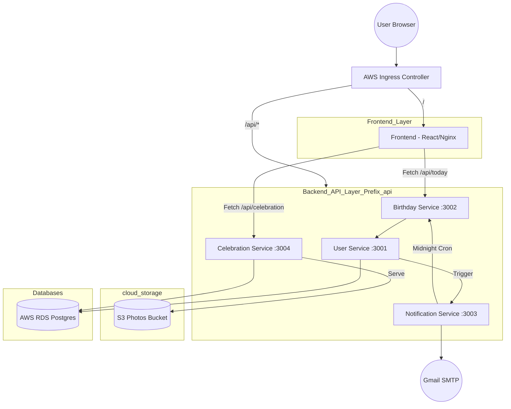

# Birthday Microservices Application 🎂

A modern, cloud-native microservices application for managing and celebrating birthdays. Featuring a high-performance React frontend with glassmorphism UI, fireworks animations, and automated email notifications.

## 🏗️ Architecture Diagram



## 🚀 Services Overview

| Service | Port | Path Prefix | Responsibility |
| :--- | :--- | :--- | :--- |
| **Frontend** | 80 | `/` | React UI with Glassmorphism, Fireworks, and Audio. |
| **User Service** | 3001 | `/api/users` | Manages registration and profiles in RDS. |
| **Birthday Service** | 3002 | `/api/today` | Identifies whose birthday it is today. |
| **Notification Service** | 3003 | `/api/notify` | Sends automated birthday emails via SMTP. |
| **Celebration Service** | 3004 | `/api/celebration` | Serves celebration gallery photos from S3. |

## 🛠️ Deployment Options

### 1. Cloud Deployment (AWS + Kubernetes) ☁️
The production-ready approach using EKS, RDS, and S3.

```powershell
# 1. Update Helm Values with RDS/S3 details
# 2. Rebuild and Push images to ECR
# 3. Apply via Helm
helm upgrade --install birthday-app ./k8s-helm/birthday-app -n default

# 4. Restart to pick up latest ECR images
kubectl rollout restart deployment frontend user-service notification-service birthday-service celebration-service
```

### 2. Local Development (Docker Compose) 🐳
The easiest way to run the entire stack locally with automated networking:

```powershell
# Start everything in one go
docker-compose up -d --build
```

---

## 🗄️ Networking & Routing

- **Ingress Isolation**: All backend services are isolated behind the `/api/` prefix to prevent conflicts with Frontend SPA routing.
- **Anchor Linking**: Email links use `/#celebration` to ensure the browser loads the UI before scrolling to the gallery.
- **RDS Connectivity**: Backend services connect to AWS RDS using the `DB_HOST` environment variable provided via Helm.
- **S3 Storage**: Photos are served directly from a public S3 bucket with the AP-SOUTH-2 region prefix.

---

## 🔐 Environment Variables
Key configuration tokens are managed via Helm `values.yaml` and injected into pods:
- `DB_HOST`, `DB_USER`, `DB_PASSWORD`: Database credentials.
- `FRONTEND_URL`: Used for generating absolute links in emails.
- `EMAIL`, `PASSWORD`: Gmail SMTP credentials for notifications.

## ✨ Key Technical Features
- **Regex-Free Routing**: Services listen directly on `/api` paths for maximum Ingress compatibility.
- **Database Safeguards**: The `photos` table uses a `UNIQUE` constraint on `url` to prevent gallery duplicates.
- **Glassmorphism UI**: Premium design using Framer Motion and modern CSS backdrop-filters.
- **Intelligent Cron**: `node-cron` identifies birthdays precisely in the `Asia/Kolkata` timezone.
