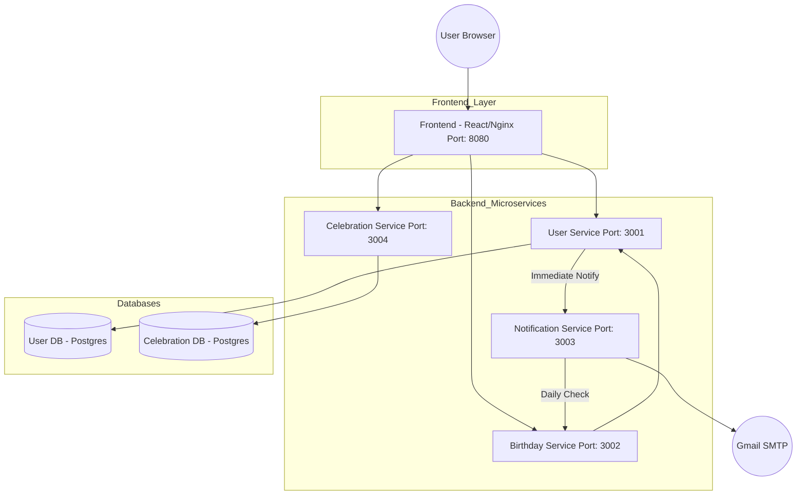

# Birthday Microservices Application 🎂

A modern, Dockerized microservices application for managing and celebrating birthdays. Featuring a high-performance React frontend with glassmorphism UI, fireworks animations, and automated email notifications.

## 🏗️ Architecture Diagram



## 🚀 Services Overview

| Service | Port | Responsibility |
| :--- | :--- | :--- |
| **Frontend** | 8080 | React SPA with Aurora backgrounds and Fireworks. |
| **User Service** | 3001 | Manages user registration and profiles in PostgreSQL. |
| **Birthday Service** | 3002 | Filters and identifies users with birthdays today. |
| **Notification Service** | 3003 | Sends emails via Nodemailer and runs daily cron jobs. |
| **Celebration Service** | 3004 | Manages and serves celebration gallery photos. |

## 📦 Docker Setup

Each service is fully containerized. To run the application:

### 1. Build the Images
From the root directory, navigate to each folder and run:
```powershell
# Frontend
cd frontend/frontend
docker build -t birthday-frontend .

# User Service
cd ../../backend/user-service
docker build -t birthday-user-service .

# ... Repeat for other services
```

### 2. Run the Containers
Pass the environment variables and map the ports:
```powershell
docker run -d -p 8080:80 --name birthday-app birthday-frontend
docker run -d -p 3001:3001 --env-file .env --name user-service birthday-user-service
docker run -d -p 3002:3002 --env-file .env --name birthday-service birthday-birthday-service
docker run -d -p 3003:3003 --env-file .env --name notification-service birthday-notification-service
docker run -d -p 3004:3004--env-file .env --name celebration-service birthday-celebration-service
```

## 🔐 Configuration (.env)

All backend services require a `.env` file. Important settings for Docker:
- **`DB_HOST=host.docker.internal`**: Allows Docker containers to connect to your local database on Windows.
- **Inter-service URLs**: Use `http://host.docker.internal:PORT` for service-to-service communication.

---

## 🛠️ Key Technical Features
- **SPA Routing**: Custom Nginx configuration handles page refreshes on sub-routes.
- **CORS Handling**: Backend services are tuned to accept requests from `http://localhost:8080`.
- **Scheduled Tasks**: `node-cron` identifies birthdays at midnight and triggers automated emails.
- **Micro-Animations**: Uses `framer-motion` and `react-confetti` for a premium user experience.
