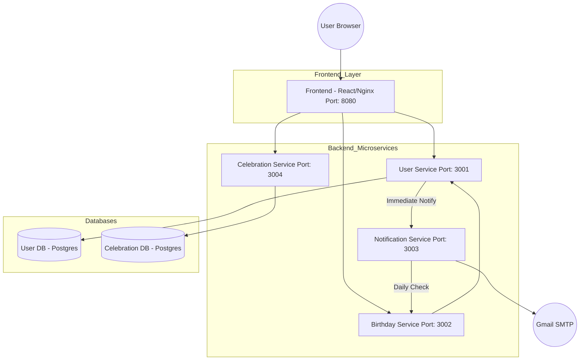

# Birthday Microservices Application 🎂

A modern, Dockerized microservices application for managing and celebrating birthdays. Featuring a high-performance React frontend with glassmorphism UI, fireworks animations, and automated email notifications.

## 🏗️ Architecture Diagram



## 🚀 Services Overview

| Service | Port | Responsibility |
| :--- | :--- | :--- |
| **Frontend** | 8080 | React SPA with Aurora backgrounds and Fireworks. |
| **User Service** | 3001 | Manages user registration and profiles in PostgreSQL. |
| **Birthday Service** | 3002 | Filters and identifies users with birthdays today. |
| **Notification Service** | 3003 | Sends emails via Nodemailer and runs daily cron jobs. |
| **Celebration Service** | 3004 | Manages and serves celebration gallery photos. |

## 🛠️ Deployment Options

We offer two ways to deploy the application: the modern **Docker Compose** approach (recommended) and the **Legacy Manual** approach.

### 1. Modern Deployment (Recommended) 🚀
The easiest way to run the entire stack (including the database) with automated networking:

```powershell
# Start everything in one go
docker-compose up -d --build
```

*   **Database**: Automatically initialized with tables and dummy data via `init.sql`.
*   **Networking**: Services communicate via a custom bridge network (`birthday-network`).
*   **Access**: Main UI at `http://localhost:8080`.

### 2. Manual Deployment (Legacy Version) 🏗️
If you need to build and run services individually (requires a pre-existing host database):

<details>
<summary>Click to see Manual Docker Commands</summary>

#### Build Images
```powershell
docker build -t birthday-user-service ./backend/user-service
docker build -t birthday-birthday-service ./backend/birthday-service
docker build -t birthday-notification-service ./backend/notification-service
docker build -t birthday-celebration-service ./backend/celebration-service
docker build -t birthday-frontend ./frontend/frontend
```

#### Run Containers
```powershell
docker run -d -p 3001:3001 --name user-service birthday-user-service
docker run -d -p 3002:3002 --name birthday-service birthday-birthday-service
docker run -d -p 3003:3003 --name notification-service birthday-notification-service
docker run -d -p 3004:3004 --name celebration-service birthday-celebration-service
docker run -d -p 8080:80 --name frontend birthday-frontend
```
</details>

---

## 🗄️ Networking & Communication

- **Internal Service Names**: Within the Docker network, services use names (`db`, `user-service`, `notification-service`) instead of IP addresses.
- **Port Mapping**:
    - **Frontend**: `8080` (Browser) -> `80` (Nginx)
    - **Database**: `5433` (Host) -> `5432` (Container)
- **CORS**: All APIs are configured to trust `http://localhost:8080`.

---

## 🔐 Environment Variables
Each service requires a `.env` file containing secrets like `EMAIL` and `PASSWORD`. These are automatically loaded by Docker Compose via the `env_file` property.

## ✨ Key Technical Features
- **SPA Routing**: Custom Nginx configuration handles sub-routes.
- **Daily Cron Jobs**: `node-cron` checks for birthdays at midnight.
- **Glassmorphism UI**: Beautiful, premium design using Tailwind CSS and Framer Motion.
